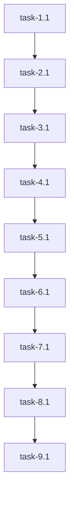

### Phase 0: Comprehensive Discovery

**Sub-steps:**
1. Read the customer request and Ecko’s optimized specification.
2. Count explicit requirements.
3. Survey repository for relevant files and architecture.
4. Identify gaps and implied needs.
5. Map context sources for each required section.
6. Plan atomic tasks and dependencies.

---

#### 1. Explicit Requirements Analysis

**Customer Request:**  
"Explain the file indexing system architecture"

**Ecko’s Optimized Specification:**  
Requires a technical architecture explanation covering:
- Overview (diagram/description)
- Component breakdown (FileIndexer, FileWatchManager, GitignoreHandler, ContextManager, GraphManager)
- Data flow
- Real example
- Key patterns/decisions
- Limitations/extensibility
- Verification checklist

**Explicit Requirements Found:**  
- 7 main content sections (Overview, Component Breakdown, Data Flow, Example, Patterns/Decisions, Limitations/Extensibility, Checklist)
- 1 verification step (context assumptions)

**Implied Needs:**  
- Must reference actual code in 5 files.
- Must verify context assumptions before writing.
- Must target intermediate/expert developers.

**Total Explicit Requirements:** 7  
**Total Implied Requirements:** 3  
**Total Scope:** 10 requirements

---

#### 2. Repository State Survey

**Relevant Files:**
- `indexing/FileIndexer.ts` (main indexing logic)
- `indexing/FileWatchManager.ts` (file system events)
- `indexing/GitignoreHandler.ts` (.gitignore filtering)
- `managers/ContextManager.ts` (context management)
- `managers/GraphManager.ts` (graph management)

**Existing Documentation:**  
- `orchestrator/README.md` (general, not indexing-specific)
- No dedicated architecture doc for indexing system.

**Technology Stack:**  
- Node.js, TypeScript

---

#### 3. Context Sources

**For Each Section:**
- Overview: All 5 files, README.md
- Component Breakdown: Each file’s implementation
- Data Flow: FileIndexer, FileWatchManager, GitignoreHandler
- Example: Code snippets from FileIndexer, GraphManager
- Patterns/Decisions: Comments in code, modular structure
- Limitations/Extensibility: Code comments, TODOs, inferred from implementation
- Checklist: Derived from above

---

#### 4. Task Breakdown

**Phases:**
- Phase 1: Context Verification
- Phase 2: Architecture Overview
- Phase 3: Component Breakdown
- Phase 4: Data Flow Explanation
- Phase 5: Real Example
- Phase 6: Patterns & Decisions
- Phase 7: Limitations & Extensibility
- Phase 8: Verification Checklist
- Phase 9: Final Assembly & Review

---

## Task Breakdown & Execution Plan

---

### **Phase 1: Context Verification**

**Task ID:** task-1.1  
**Title:** Verify File Indexing System Context Assumptions  
**Worker Role:**  
Documentation engineer with TypeScript and Node.js expertise, experienced in codebase analysis, architecture documentation, and onboarding material creation. Understands modular design and file system APIs, familiar with Express and TypeScript conventions.

**Prompt:**  
- Read and summarize the purpose of each of the following files:
  - `indexing/FileIndexer.ts`
  - `indexing/FileWatchManager.ts`
  - `indexing/GitignoreHandler.ts`
  - `managers/ContextManager.ts`
  - `managers/GraphManager.ts`
- Confirm that each file matches its described role in the specification.
- Note any discrepancies or missing functionality.

**Dependencies:** None  
**Estimated Duration:** 30 min  
**Verification Criteria:**  
- [ ] Each file’s main responsibility is confirmed.
- [ ] Any mismatches or missing features are documented.
- [ ] Output is a concise summary for each file.

---

### **Phase 2: Architecture Overview**

**Task ID:** task-2.1  
**Title:** Write High-Level Architecture Overview of File Indexing System  
**Worker Role:**  
Software architect with Node.js and TypeScript expertise, experienced in system design, technical writing, and diagramming. Understands modular architectures and file system event handling.

**Prompt:**  
- Using verified context, write a high-level overview of the file indexing system.
- Include a diagram (Mermaid or textual) showing major components and their relationships.
- Reference actual file/module names.

**Dependencies:** task-1.1  
**Estimated Duration:** 45 min  
**Verification Criteria:**  
- [ ] Overview covers all major components.
- [ ] Diagram is present and accurate.
- [ ] References to real files/modules.

---

### **Phase 3: Component Breakdown**

**Task ID:** task-3.1  
**Title:** Document Responsibilities and Interactions of Major Components  
**Worker Role:**  
Technical writer with TypeScript and Node.js expertise, experienced in component documentation and onboarding guides. Understands modularization and dependency management.

**Prompt:**  
- For each component (FileIndexer, FileWatchManager, GitignoreHandler, ContextManager, GraphManager):
  - Describe its responsibilities.
  - Explain how it interacts with other components.
  - Reference code examples or function signatures.

**Dependencies:** task-2.1  
**Estimated Duration:** 60 min  
**Verification Criteria:**  
- [ ] Each component is described in detail.
- [ ] Interactions are clearly explained.
- [ ] Code references are accurate.

---

### **Phase 4: Data Flow Explanation**

**Task ID:** task-4.1  
**Title:** Explain Data Flow from File Discovery to Indexing  
**Worker Role:**  
System analyst with Node.js and TypeScript expertise, experienced in data flow documentation and event-driven architectures. Understands file system APIs and observer patterns.

**Prompt:**  
- Trace the flow of a file from discovery (e.g., new file added) through filtering, indexing, and graph/context update.
- Reference specific functions/methods in the code.
- Highlight how changes are propagated.

**Dependencies:** task-3.1  
**Estimated Duration:** 45 min  
**Verification Criteria:**  
- [ ] Data flow is clearly explained.
- [ ] References to code are present.
- [ ] Change propagation is described.

---

### **Phase 5: Real Example**

**Task ID:** task-5.1  
**Title:** Provide Concrete Example of File Indexing and Graph Update  
**Worker Role:**  
Documentation engineer with TypeScript and Node.js expertise, experienced in example-driven documentation and onboarding. Understands file system event handling and graph data structures.

**Prompt:**  
- Walk through a real example: a new file is added to the project.
- Show how it is discovered, filtered, indexed, and added to the graph/context.
- Use code snippets and step-by-step explanation.

**Dependencies:** task-4.1  
**Estimated Duration:** 45 min  
**Verification Criteria:**  
- [ ] Example is realistic and complete.
- [ ] Code snippets are accurate.
- [ ] All steps are covered.

---

### **Phase 6: Patterns & Design Decisions**

**Task ID:** task-6.1  
**Title:** Highlight Key Architectural Patterns and Design Decisions  
**Worker Role:**  
Software architect with Node.js and TypeScript expertise, experienced in design pattern analysis and technical documentation. Understands observer, dependency injection, and modularization.

**Prompt:**  
- Identify and explain key patterns used (e.g., observer, modularization).
- Discuss why certain design decisions were made (e.g., separate GitignoreHandler).
- Reference code and comments where possible.

**Dependencies:** task-5.1  
**Estimated Duration:** 30 min  
**Verification Criteria:**  
- [ ] Patterns are identified and explained.
- [ ] Design decisions are justified.
- [ ] Code references are present.

---

### **Phase 7: Limitations & Extensibility**

**Task ID:** task-7.1  
**Title:** Document Limitations and Extensibility Points of Indexing System  
**Worker Role:**  
Technical writer with Node.js and TypeScript expertise, experienced in system analysis and future-proofing documentation. Understands extensibility patterns and system limitations.

**Prompt:**  
- List current limitations (e.g., only local file system support).
- Describe how the architecture supports future extension (e.g., remote file systems, plugin support).
- Reference code comments or TODOs.

**Dependencies:** task-6.1  
**Estimated Duration:** 30 min  
**Verification Criteria:**  
- [ ] At least one limitation is listed.
- [ ] At least one extensibility point is described.
- [ ] References to code or comments are present.

---

### **Phase 8: Verification Checklist**

**Task ID:** task-8.1  
**Title:** Create Reader Verification Checklist for Indexing System Architecture  
**Worker Role:**  
Documentation engineer with onboarding expertise, experienced in checklist creation and self-assessment guides. Understands technical documentation best practices.

**Prompt:**  
- Create a checklist for readers to verify their understanding:
  - Identify each major component and its role
  - Trace the flow of a file from discovery to indexing
  - Explain how .gitignore filtering is applied
  - Describe how file changes are handled
  - List at least one limitation and one extensibility point

**Dependencies:** task-7.1  
**Estimated Duration:** 15 min  
**Verification Criteria:**  
- [ ] Checklist covers all required points.
- [ ] Items are clear and actionable.

---

### **Phase 9: Final Assembly & Review**

**Task ID:** task-9.1  
**Title:** Assemble and Review Complete File Indexing System Architecture Document  
**Worker Role:**  
Senior technical writer with Node.js and TypeScript expertise, experienced in assembling technical documentation and peer review. Understands architecture documentation standards.

**Prompt:**  
- Assemble all previous sections into a single, well-structured markdown document.
- Review for completeness, clarity, and technical accuracy.
- Ensure all references are to real files/components.
- Target intermediate to expert developers.

**Dependencies:** task-8.1  
**Estimated Duration:** 30 min  
**Verification Criteria:**  
- [ ] All sections are present and complete.
- [ ] Document is clear and technically accurate.
- [ ] No placeholders; all references are real.

---

## Dependency Graph

---

## Context Sources

- `indexing/FileIndexer.ts`
- `indexing/FileWatchManager.ts`
- `indexing/GitignoreHandler.ts`
- `managers/ContextManager.ts`
- `managers/GraphManager.ts`
- `orchestrator/README.md` (for general context)
- Code comments and function signatures

---

## Summary

**Total Tasks:** 9  
**All requirements from Ecko’s specification are covered.**  
**Each task is atomic, with clear context, dependencies, and verification criteria.**  
**Ready for worker agent execution.**