# Cypher Executor Modes: Architecture Overview

> **Environment Variable:** `NORNICDB_EXECUTOR_MODE`  
> **Options:** `nornic` | `antlr` | `hybrid` (default)

## Architecture Diagram

```mermaid
%%{init: {'theme': 'dark', 'themeVariables': { 'primaryColor': '#1f6feb', 'primaryTextColor': '#c9d1d9', 'primaryBorderColor': '#30363d', 'lineColor': '#8b949e', 'secondaryColor': '#238636', 'tertiaryColor': '#21262d', 'background': '#0d1117', 'mainBkg': '#161b22', 'textColor': '#c9d1d9'}}}%%

flowchart TB
    subgraph ENV["🔧 Configuration"]
        direction LR
        E1["NORNICDB_EXECUTOR_MODE"]
        E2["nornic | antlr | hybrid"]
    end

    Q[/"Cypher Query"/]
    
    Q --> FACTORY["NewCypherExecutor()"]
    
    FACTORY --> |"mode=nornic"| NORNIC
    FACTORY --> |"mode=antlr"| ANTLR
    FACTORY --> |"mode=hybrid"| HYBRID
    
    subgraph NORNIC["⚡ Nornic Mode"]
        direction TB
        N1["String Parser"]
        N2["Regex + indexOf"]
        N3["Direct Execution"]
        N1 --> N2 --> N3
    end
    
    subgraph ANTLR["🌳 ANTLR Mode"]
        direction TB
        A1["ANTLR Lexer"]
        A2["ANTLR Parser"]
        A3["Full AST"]
        A4["AST Walker"]
        A1 --> A2 --> A3 --> A4
    end
    
    subgraph HYBRID["🔀 Hybrid Mode (Default)"]
        direction TB
        H1["Query Arrives"]
        H2["String Executor<br/>(Fast Path)"]
        H3["Background Worker"]
        H4["AST Cache"]
        
        H1 --> H2
        H1 -.-> |"async"| H3
        H3 --> H4
        
        style H2 fill:#238636,stroke:#3fb950
        style H3 fill:#1f6feb,stroke:#58a6ff
        style H4 fill:#6e40c9,stroke:#a371f7
    end
    
    NORNIC --> RESULT[("Result")]
    ANTLR --> RESULT
    HYBRID --> RESULT
    
    HYBRID -.-> |"cached AST for<br/>LLM features"| LLM["🤖 LLM Integration"]
    
    style ENV fill:#21262d,stroke:#30363d
    style NORNIC fill:#161b22,stroke:#f85149
    style ANTLR fill:#161b22,stroke:#a371f7
    style HYBRID fill:#161b22,stroke:#3fb950
    style RESULT fill:#238636,stroke:#3fb950
    style LLM fill:#1f6feb,stroke:#58a6ff
```



## Query Flow Comparison


## Mode Comparison

| Feature | ⚡ Nornic | 🌳 ANTLR | 🔀 Hybrid |
|---------|----------|----------|-----------|
| **Throughput** | 3,000-4,200 hz | 0.8-2,100 hz | 3,000-4,200 hz |
| **Benchmark Time** | 17.5s | 35.3s | 17.5s |
| **Worst Case Slowdown** | - | 4,753x | - |
| **Full AST Available** | ❌ No | ✅ Yes | ✅ Yes (async) |
| **LLM Query Manipulation** | ❌ Limited | ✅ Full support | ✅ Full support |
| **Memory Usage** | Lowest | Highest | Medium |
| **Query Validation** | Basic | Complete | Complete (async) |
| **Best For** | Max speed | Dev/Analysis | **Production + LLM** |

## Detailed Pros & Cons

### ⚡ Nornic Mode (`NORNICDB_EXECUTOR_MODE=nornic`)

**Pros:**
- 🚀 **Fastest execution** - 420ns/op average
- 💾 **Lowest memory** - No AST allocation
- 🔧 **Battle-tested** - Original implementation
- ⚡ **Zero parsing overhead** - Direct string manipulation

**Cons:**
- 🤖 **No LLM integration** - Can't safely manipulate queries
- 🔍 **Limited introspection** - No structured query analysis
- 🐛 **Harder to debug** - No AST to inspect
- 📊 **No query optimization** - Can't analyze query structure

**Use When:**
- Maximum performance is critical
- No LLM features needed
- Simple query patterns

---

### 🌳 ANTLR Mode (`NORNICDB_EXECUTOR_MODE=antlr`)

**Pros:**
- 🌳 **Full AST** - Complete parse tree for every query
- 🤖 **LLM-ready** - Safe query manipulation/correction
- 🔍 **Rich introspection** - Analyze any query structure
- ✅ **Strict validation** - Grammar-enforced syntax checking
- 🛠️ **Extensible** - Easy to add new Cypher features

**Cons:**
- 🐢 **Slowest execution** - ~165x slower than Nornic
- 💾 **High memory** - Full parse tree allocation
- 🔄 **Parse overhead** - Every query fully parsed
- ⏱️ **Not for hot paths** - Too slow for high-throughput

**Use When:**
- Development and debugging
- Query analysis tools
- LLM features are the priority over speed
- Building query optimization pipelines

---

### 🔀 Hybrid Mode (`NORNICDB_EXECUTOR_MODE=hybrid`) **← DEFAULT**

**Pros:**
- ⚡ **Fast execution** - Same speed as Nornic (~3% overhead)
- 🌳 **AST available** - Built asynchronously in background
- 🤖 **LLM-ready** - Cached AST for manipulation features
- 🎯 **Best of both** - Production speed + rich features
- 📊 **Stats tracking** - Monitor cache hits/misses

**Cons:**
- 💾 **Medium memory** - Caches grow over time
- 🔄 **Async complexity** - AST not immediately available
- ⏱️ **Cold start** - First query doesn't have cached AST
- 🧹 **Cache management** - May need periodic cleanup

**Use When:**
- **Production deployments** (recommended default)
- Need both speed and LLM features
- Can tolerate async AST availability
- Want monitoring/stats capabilities

---

## Performance Benchmarks

### Micro-benchmarks (M3 Max)

```
BenchmarkNornic_Execute-16     2,832,133    420.6 ns/op    128 B/op    4 allocs/op
BenchmarkHybrid_Execute-16     2,711,396    428.4 ns/op    128 B/op    4 allocs/op
BenchmarkANTLR_Execute-16         16,851  70,234.0 ns/op  45312 B/op  892 allocs/op
```

### Real-World Benchmarks (Northwind Database)

| Query | ⚡ Nornic (hz) | 🔀 Hybrid (hz) | 🌳 ANTLR (hz) | ANTLR Slowdown |
|-------|---------------|----------------|---------------|----------------|
| Count all nodes | 3,272 | 3,312 | 45 | **73x slower** |
| Count all relationships | 3,693 | 3,750 | 50 | **74x slower** |
| Find customer by ID | 4,213 | 4,009 | 2,153 | 2x slower |
| Products in Beverages category | 4,176 | 4,034 | 1,282 | 3x slower |
| Products supplied by Exotic Liquids | 4,023 | 4,133 | 53 | **76x slower** |
| Supplier→Category through products | 3,225 | 3,342 | 22 | **147x slower** |
| Products with/without orders | 3,881 | 3,967 | **0.82** | **4,753x slower** |
| Create and delete relationship | 3,974 | 3,956 | 62 | **64x slower** |

**Total benchmark time:**
- ⚡ Nornic: **17.5 seconds**
- 🔀 Hybrid: **17.5 seconds**  
- 🌳 ANTLR: **35.3 seconds** (2x slower)

### Key Findings

1. **Hybrid = Nornic performance** - Zero measurable overhead in real workloads
2. **ANTLR is 50-5000x slower** depending on query complexity
3. **ANTLR catastrophic on complex queries** - Some queries take 1,224ms vs 0.25ms
4. **Hybrid is the clear winner** - Same speed as Nornic + AST for LLM features

## Configuration Examples

```bash
# Production (default) - fast + LLM ready
export NORNICDB_EXECUTOR_MODE=hybrid

# Maximum speed - no LLM features
export NORNICDB_EXECUTOR_MODE=nornic

# Development/Analysis - full AST always
export NORNICDB_EXECUTOR_MODE=antlr
```

## Startup Banner

When NornicDB starts, you'll see:

```
╔═══════════════════════════════════════════════════════════════════════╗
║  🔧 CYPHER EXECUTOR MODE: hybrid                                      ║
║     Hybrid executor - fast string execution + background AST building ║
║                                                                       ║
║  Set NORNICDB_EXECUTOR_MODE to: nornic | antlr | hybrid               ║
╚═══════════════════════════════════════════════════════════════════════╝
```

## LLM Integration Architecture


## Related Files

- `pkg/config/executor_mode.go` - Configuration
- `pkg/cypher/executor_factory.go` - Factory function
- `pkg/cypher/hybrid_executor.go` - Hybrid implementation
- `pkg/cypher/ast_executor.go` - ANTLR implementation
- `pkg/cypher/executor.go` - Nornic (string) implementation

---

**Questions?** Open an issue or check the test files for usage examples:
- `pkg/cypher/executor_mode_test.go` - Comprehensive mode tests
- `pkg/cypher/hybrid_executor_test.go` - Hybrid-specific tests
